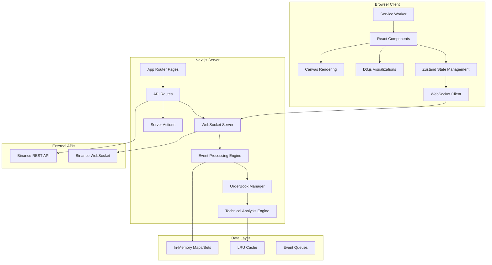

# Design Document

## Overview

FlowSight Web is a complete architectural redesign that transforms the existing Rust desktop application into a modern, high-performance web application using Next.js 14. The design emphasizes real-time data processing, professional trading interface design, and scalable web architecture while maintaining the analytical capabilities of the original system.

The application follows a pure JavaScript/TypeScript architecture with no external database dependencies, utilizing in-memory data structures for optimal performance and simplified deployment.

## Architecture

### System Architecture



### Data Flow Architecture

The system implements a reactive data flow pattern:

1. **Data Ingestion**: Binance WebSocket → Next.js WebSocket Server
2. **Processing**: Event Processing Engine → OrderBook Manager → Technical Analysis
3. **State Management**: Server State → Client State (Zustand) → React Components
4. **Visualization**: React Components → D3.js/Canvas → DOM Updates

### Technology Stack

**Frontend Stack:**
- Next.js 14 with App Router for modern React architecture
- TypeScript 5 for type safety and developer experience
- Zustand for lightweight, performant state management
- React Query for server state synchronization
- D3.js for complex data visualizations
- Canvas API for high-performance chart rendering
- Tailwind CSS for responsive, utility-first styling
- Framer Motion for smooth animations

**Backend Stack:**
- Node.js 18+ runtime environment
- Next.js API Routes for RESTful endpoints
- WebSocket (ws library) for real-time communication
- EventEmitter for internal event handling
- Native JavaScript data structures (Map, Set, Array)
- LRU Cache for memory management

## Components and Interfaces

### Core Component Hierarchy

```
App Layout
├── StatusBar (Connection status, performance metrics)
├── MainLayout (Three-panel container)
    ├── OrderBookPanel (Left 50%)
    │   ├── OrderBookHeader
    │   ├── OrderBookTable
    │   └── OrderBookControls
    ├── ActiveOrderChart (Upper-right 45%)
    │   ├── ChartHeader
    │   ├── LineChart (D3.js)
    │   ├── DotOverlay (Volume dots)
    │   └── ChartControls
    └── FootprintChart (Lower-right 55%)
        ├── FootprintHeader
        ├── CandlestickChart (D3.js)
        ├── VolumeHeatmap
        └── FootprintControls
```

### Key Interface Definitions

```typescript
// Core trading data interfaces
interface OrderFlow {
  price: number
  bidVolume: number
  askVolume: number
  activeBuyVolume: number
  activeSellVolume: number
  historicalBuyVolume: number
  historicalSellVolume: number
  timestamp: number
}

interface MarketSnapshot {
  symbol: string
  bestBid: number | null
  bestAsk: number | null
  currentPrice: number | null
  spread: number
  realizedVolatility: number
  jumpSignal: number
  orderBookImbalance: number
  volumeWeightedMomentum: number
  timestamp: number
}

interface FootprintCandle {
  timestamp: number
  open: number
  high: number
  low: number
  close: number
  volume: number
  levels: Map<number, FootprintLevel>
}

// State management interfaces
interface OrderBookState {
  orderFlows: Map<number, OrderFlow>
  marketSnapshot: MarketSnapshot | null
  tradeHistory: TradeData[]
  currentPrice: number | null
  connectionStatus: ConnectionStatus
  performanceMetrics: PerformanceMetrics
}

// WebSocket communication interfaces
interface WebSocketMessage {
  stream: string
  data: any
  timestamp: number
}

interface BinanceDepthStream {
  e: 'depthUpdate'
  E: number // Event time
  s: string // Symbol
  b: [string, string][] // Bids
  a: [string, string][] // Asks
}
```

### Component Design Patterns

**1. Container/Presentation Pattern**
- Container components handle data fetching and state management
- Presentation components focus on rendering and user interaction
- Clear separation of concerns for maintainability

**2. Compound Component Pattern**
- Complex components like OrderBookPanel composed of smaller, focused components
- Enables flexible composition and reusability

**3. Render Props Pattern**
- Chart components use render props for customizable visualization
- Allows different chart types to share common data processing logic

## Data Models

### In-Memory Data Structures

**OrderBook Storage:**
```typescript
class OrderBookManager {
  private orderFlows = new Map<number, OrderFlow>()
  private priceHistory: Array<PricePoint> = []
  private tradeHistory: Array<TradeData> = []
  private technicalIndicators = new Map<string, number>()
}
```

**Footprint Data Storage:**
```typescript
class FootprintEngine {
  private candles = new Map<number, FootprintCandle>()
  private readonly timeframe: number = 5 * 60 * 1000 // 5 minutes
  private readonly priceStep: number = 0.5 // Price aggregation
}
```

**Performance Optimization:**
- LRU Cache for frequently accessed data
- Automatic cleanup of stale data (>5 minutes old)
- Event batching for high-frequency updates
- Memory usage monitoring and garbage collection triggers

### Data Aggregation Strategy

**Price Level Aggregation:**
- Configurable price step (default 0.5 USDT)
- Dynamic aggregation based on price range
- Volume-weighted price calculations

**Time-based Aggregation:**
- 5-minute candlestick intervals for footprint charts
- 1-second intervals for real-time indicators
- Sliding window calculations for technical analysis

**Memory Management:**
- Maximum 1000 trade records in memory
- Maximum 40 order book levels displayed
- Automatic pruning of inactive price levels
- Configurable data retention periods

## Error Handling

### Error Categories and Strategies

**1. Network Errors**
- WebSocket connection failures
- API rate limiting
- Network timeouts

*Strategy:* Exponential backoff reconnection, graceful degradation, user notification

**2. Data Processing Errors**
- Malformed JSON from Binance API
- Invalid price/volume data
- Calculation overflow/underflow

*Strategy:* Data validation, error logging, continue processing with fallback values

**3. Performance Errors**
- Memory exhaustion
- CPU overload
- Rendering bottlenecks

*Strategy:* Performance monitoring, automatic data cleanup, frame rate throttling

**4. User Interface Errors**
- Component rendering failures
- State synchronization issues
- Browser compatibility problems

*Strategy:* Error boundaries, fallback UI components, progressive enhancement

### Error Recovery Mechanisms

```typescript
class ErrorRecoveryManager {
  private errorCounts = new Map<string, number>()
  private readonly maxRetries = 3
  
  async handleError(error: Error, context: string): Promise<void> {
    const count = this.errorCounts.get(context) || 0
    
    if (count < this.maxRetries) {
      this.errorCounts.set(context, count + 1)
      await this.retryOperation(context)
    } else {
      this.fallbackToSafeMode(context)
    }
  }
  
  private async retryOperation(context: string): Promise<void> {
    const delay = Math.pow(2, this.errorCounts.get(context) || 0) * 1000
    await new Promise(resolve => setTimeout(resolve, delay))
    // Retry logic here
  }
}
```

## Testing Strategy

### Testing Pyramid

**Unit Tests (70%)**
- Data processing functions
- Technical indicator calculations
- Utility functions
- Component logic

**Integration Tests (20%)**
- WebSocket connection handling
- State management flows
- API integration
- Component interactions

**End-to-End Tests (10%)**
- Complete user workflows
- Real-time data processing
- Performance benchmarks
- Cross-browser compatibility

### Testing Tools and Frameworks

**Frontend Testing:**
- Jest for unit testing
- React Testing Library for component testing
- Playwright for E2E testing
- Storybook for component documentation

**Backend Testing:**
- Jest for API route testing
- WebSocket testing utilities
- Performance testing with Artillery
- Memory leak detection

**Real-time Testing:**
- Mock WebSocket servers
- Data replay systems
- Load testing with concurrent connections
- Latency measurement tools

### Performance Testing Criteria

**Latency Requirements:**
- WebSocket message processing: <50ms
- UI updates: <16ms (60fps)
- State synchronization: <100ms

**Throughput Requirements:**
- Handle 1000+ messages per second
- Support 100+ concurrent users
- Process 10,000+ order book updates per minute

**Memory Requirements:**
- Maximum 200MB heap usage
- Automatic cleanup every 5 minutes
- No memory leaks over 24-hour operation

## Security Considerations

### Data Security

**Client-Side Security:**
- No sensitive data stored in browser
- Secure WebSocket connections (WSS)
- Content Security Policy (CSP) headers
- XSS protection through React's built-in sanitization

**Server-Side Security:**
- Rate limiting on API endpoints
- WebSocket connection limits
- Input validation and sanitization
- CORS configuration for allowed origins

**Network Security:**
- HTTPS enforcement
- WebSocket over TLS (WSS)
- API key management for Binance integration
- Request/response logging for audit trails

### Performance Security

**DoS Protection:**
- Connection rate limiting
- Message size limits
- Memory usage monitoring
- Automatic connection throttling

**Resource Management:**
- CPU usage monitoring
- Memory leak prevention
- Garbage collection optimization
- Event queue size limits

## Deployment Architecture

### Production Deployment

**Container Strategy:**
```dockerfile
FROM node:18-alpine AS builder
WORKDIR /app
COPY package*.json ./
RUN npm ci --only=production
COPY . .
RUN npm run build

FROM node:18-alpine AS runner
WORKDIR /app
COPY --from=builder /app/.next/standalone ./
COPY --from=builder /app/.next/static ./.next/static
EXPOSE 3000
CMD ["node", "server.js"]
```

**Infrastructure Components:**
- Docker containers for application deployment
- Nginx reverse proxy for load balancing
- Redis for session management (optional)
- Prometheus + Grafana for monitoring
- ELK stack for logging and analytics

### Scalability Design

**Horizontal Scaling:**
- Stateless application design
- WebSocket connection distribution
- Load balancer configuration
- Session affinity for WebSocket connections

**Vertical Scaling:**
- Memory optimization strategies
- CPU usage optimization
- I/O performance tuning
- Database-free architecture benefits

### Monitoring and Observability

**Application Metrics:**
- WebSocket connection count
- Message processing rate
- Memory usage patterns
- Error rates and types

**Business Metrics:**
- Active user count
- Data processing latency
- Feature usage analytics
- Performance benchmarks

**Alerting Strategy:**
- Connection failure alerts
- Performance degradation warnings
- Memory usage thresholds
- Error rate spike notifications

## Migration Strategy

### Phase 1: Foundation (Weeks 1-4)
- Next.js project setup and configuration
- Basic component structure
- WebSocket connection management
- Core state management implementation

### Phase 2: Core Features (Weeks 5-10)
- Order book visualization
- Real-time data processing
- Active order chart implementation
- Basic footprint chart functionality

### Phase 3: Advanced Features (Weeks 11-14)
- Complete footprint chart with volume analysis
- Technical indicators implementation
- Performance optimization
- Responsive design and mobile support

### Phase 4: Production Ready (Weeks 15-16)
- Comprehensive testing
- Performance tuning
- Security hardening
- Deployment and monitoring setup

### Data Migration Approach

**No Data Migration Required:**
- Pure real-time application
- No historical data dependencies
- Fresh start with current market data
- Configuration migration only

**Configuration Migration:**
- User preferences and settings
- Symbol watchlists
- Display configurations
- Custom indicator parameters

This design provides a comprehensive blueprint for transforming FlowSight into a modern, high-performance web application while maintaining its professional trading analysis capabilities.