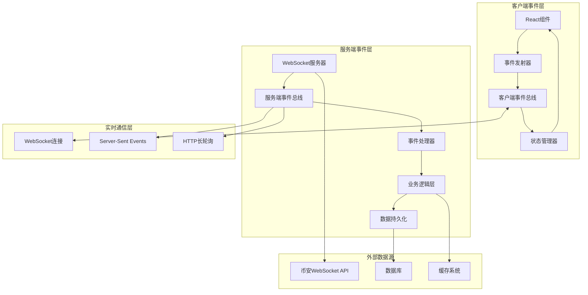

# Next.js事件驱动架构技术规格文档
## FlowSight Web版响应式事件系统设计

### 文档概述

**文档目标：** 详细说明如何在Next.js中实现高性能的事件驱动架构  
**技术重点：** 响应式数据流、事件总线、状态管理、性能优化  
**参考架构：** 基于当前Rust版本的事件驱动设计模式  

---

## 1. Next.js事件驱动能力分析

### 1.1 Next.js原生能力

**Next.js本身提供的响应式特性：**
```typescript
// ❌ Next.js没有内置的事件驱动架构
// ✅ 但提供了这些基础能力：

// 1. Server-Sent Events支持
export async function GET() {
  const stream = new ReadableStream({
    start(controller) {
      // 可以推送事件到客户端
      controller.enqueue(`data: ${JSON.stringify(marketData)}\n\n`)
    }
  })
  return new Response(stream, {
    headers: { 'Content-Type': 'text/event-stream' }
  })
}

// 2. WebSocket支持（需要自定义服务器）
// 3. React的状态更新机制
// 4. API Routes的实时数据处理
```

**局限性：**
- ❌ 没有内置的事件总线系统
- ❌ 没有内置的发布-订阅模式
- ❌ 没有内置的事件优先级管理
- ❌ 没有内置的事件持久化机制

### 1.2 需要自定义实现的核心组件

```typescript
// 需要实现的核心事件驱动组件
interface EventDrivenComponents {
  eventBus: EventBus              // 事件总线
  eventDispatcher: EventDispatcher // 事件分发器
  stateManager: StateManager      // 状态管理器
  subscriptionManager: SubscriptionManager // 订阅管理器
  eventPersistence: EventStore    // 事件持久化
}
```

---

## 2. 事件驱动架构设计

### 2.1 整体架构图



### 2.2 核心事件系统实现

#### 2.2.1 事件总线（EventBus）

```typescript
// lib/events/event-bus.ts
export interface Event<T = any> {
  id: string
  type: string
  payload: T
  timestamp: number
  priority: EventPriority
  source: string
  metadata?: Record<string, any>
}

export enum EventPriority {
  LOW = 0,
  NORMAL = 1,
  HIGH = 2,
  CRITICAL = 3
}

export class EventBus {
  private listeners = new Map<string, Set<EventListener>>()
  private eventQueue: Event[] = []
  private processing = false
  private maxQueueSize = 10000
  private batchSize = 100

  // 发布事件
  emit<T>(eventType: string, payload: T, priority = EventPriority.NORMAL): void {
    const event: Event<T> = {
      id: crypto.randomUUID(),
      type: eventType,
      payload,
      timestamp: Date.now(),
      priority,
      source: 'client',
      metadata: {}
    }

    // 根据优先级插入队列
    this.insertByPriority(event)
    
    // 异步处理事件
    this.processEvents()
  }

  // 订阅事件
  on<T>(eventType: string, listener: EventListener<T>): () => void {
    if (!this.listeners.has(eventType)) {
      this.listeners.set(eventType, new Set())
    }
    
    this.listeners.get(eventType)!.add(listener)
    
    // 返回取消订阅函数
    return () => {
      this.listeners.get(eventType)?.delete(listener)
    }
  }

  // 批量处理事件（性能优化）
  private async processEvents(): Promise<void> {
    if (this.processing) return
    
    this.processing = true
    
    try {
      while (this.eventQueue.length > 0) {
        const batch = this.eventQueue.splice(0, this.batchSize)
        
        // 并行处理批次事件
        await Promise.all(
          batch.map(event => this.processEvent(event))
        )
        
        // 让出控制权，避免阻塞UI
        await new Promise(resolve => setTimeout(resolve, 0))
      }
    } finally {
      this.processing = false
    }
  }

  private async processEvent(event: Event): Promise<void> {
    const listeners = this.listeners.get(event.type)
    if (!listeners || listeners.size === 0) return

    // 并行执行所有监听器
    const promises = Array.from(listeners).map(listener => {
      try {
        return Promise.resolve(listener(event))
      } catch (error) {
        console.error(`Event listener error for ${event.type}:`, error)
        return Promise.resolve()
      }
    })

    await Promise.all(promises)
  }

  private insertByPriority(event: Event): void {
    // 队列满时，移除低优先级事件
    if (this.eventQueue.length >= this.maxQueueSize) {
      this.eventQueue.sort((a, b) => b.priority - a.priority)
      this.eventQueue = this.eventQueue.slice(0, this.maxQueueSize * 0.8)
    }

    // 按优先级插入
    let insertIndex = this.eventQueue.length
    for (let i = 0; i < this.eventQueue.length; i++) {
      if (this.eventQueue[i].priority < event.priority) {
        insertIndex = i
        break
      }
    }
    
    this.eventQueue.splice(insertIndex, 0, event)
  }
}

type EventListener<T = any> = (event: Event<T>) => void | Promise<void>
```

#### 2.2.2 响应式状态管理器

```typescript
// lib/stores/reactive-store.ts
import { create } from 'zustand'
import { subscribeWithSelector } from 'zustand/middleware'

export interface ReactiveStore<T> {
  state: T
  dispatch: (action: Action) => void
  subscribe: (selector: (state: T) => any, callback: (value: any) => void) => () => void
}

export interface Action {
  type: string
  payload?: any
  meta?: {
    timestamp: number
    source: string
  }
}

// 创建响应式存储
export function createReactiveStore<T>(
  initialState: T,
  reducer: (state: T, action: Action) => T,
  eventBus: EventBus
) {
  const store = create<ReactiveStore<T>>()(
    subscribeWithSelector((set, get) => ({
      state: initialState,
      
      dispatch: (action: Action) => {
        const currentState = get().state
        const newState = reducer(currentState, action)
        
        set({ state: newState })
        
        // 发布状态变更事件
        eventBus.emit('state:changed', {
          action,
          previousState: currentState,
          newState
        })
      },
      
      subscribe: (selector, callback) => {
        return store.subscribe(
          (state) => selector(state.state),
          callback
        )
      }
    }))
  )

  // 监听外部事件并更新状态
  eventBus.on('*', (event) => {
    const action: Action = {
      type: event.type,
      payload: event.payload,
      meta: {
        timestamp: event.timestamp,
        source: event.source
      }
    }
    
    store.getState().dispatch(action)
  })

  return store
}
```

#### 2.2.3 WebSocket事件桥接器

```typescript
// lib/websocket/event-bridge.ts
export class WebSocketEventBridge {
  private ws: WebSocket | null = null
  private eventBus: EventBus
  private reconnectAttempts = 0
  private maxReconnectAttempts = 5
  private reconnectDelay = 1000

  constructor(eventBus: EventBus) {
    this.eventBus = eventBus
  }

  async connect(url: string): Promise<void> {
    return new Promise((resolve, reject) => {
      this.ws = new WebSocket(url)

      this.ws.onopen = () => {
        this.reconnectAttempts = 0
        this.eventBus.emit('websocket:connected', { url })
        resolve()
      }

      this.ws.onmessage = (event) => {
        try {
          const data = JSON.parse(event.data)
          
          // 将WebSocket消息转换为内部事件
          this.eventBus.emit(`market:${data.stream}`, data.data, EventPriority.HIGH)
        } catch (error) {
          console.error('WebSocket message parse error:', error)
        }
      }

      this.ws.onclose = () => {
        this.eventBus.emit('websocket:disconnected', { url })
        this.handleReconnect(url)
      }

      this.ws.onerror = (error) => {
        this.eventBus.emit('websocket:error', { error, url })
        reject(error)
      }
    })
  }

  private async handleReconnect(url: string): Promise<void> {
    if (this.reconnectAttempts >= this.maxReconnectAttempts) {
      this.eventBus.emit('websocket:max_reconnects_reached', { url })
      return
    }

    this.reconnectAttempts++
    const delay = this.reconnectDelay * Math.pow(2, this.reconnectAttempts - 1)
    
    this.eventBus.emit('websocket:reconnecting', { 
      url, 
      attempt: this.reconnectAttempts,
      delay 
    })

    await new Promise(resolve => setTimeout(resolve, delay))
    
    try {
      await this.connect(url)
    } catch (error) {
      console.error('Reconnection failed:', error)
    }
  }

  send(data: any): void {
    if (this.ws?.readyState === WebSocket.OPEN) {
      this.ws.send(JSON.stringify(data))
    } else {
      this.eventBus.emit('websocket:send_failed', { data, state: this.ws?.readyState })
    }
  }

  disconnect(): void {
    if (this.ws) {
      this.ws.close()
      this.ws = null
    }
  }
}
```

---

## 3. 业务事件处理器

### 3.1 订单簿事件处理

```typescript
// lib/handlers/orderbook-handler.ts
export class OrderBookEventHandler {
  private eventBus: EventBus
  private orderBookStore: any

  constructor(eventBus: EventBus, orderBookStore: any) {
    this.eventBus = eventBus
    this.orderBookStore = orderBookStore
    this.setupEventListeners()
  }

  private setupEventListeners(): void {
    // 监听深度更新事件
    this.eventBus.on('market:depth', (event) => {
      this.handleDepthUpdate(event.payload)
    })

    // 监听交易事件
    this.eventBus.on('market:trade', (event) => {
      this.handleTrade(event.payload)
    })

    // 监听BookTicker事件
    this.eventBus.on('market:bookTicker', (event) => {
      this.handleBookTicker(event.payload)
    })
  }

  private handleDepthUpdate(data: any): void {
    // 处理订单簿深度更新
    const { bids, asks } = data
    
    // 更新订单簿状态
    this.orderBookStore.getState().dispatch({
      type: 'UPDATE_DEPTH',
      payload: { bids, asks }
    })

    // 发布派生事件
    this.eventBus.emit('orderbook:updated', {
      bids: bids.length,
      asks: asks.length,
      timestamp: Date.now()
    })
  }

  private handleTrade(data: any): void {
    const { price, quantity, isBuyerMaker } = data
    
    // 更新交易数据
    this.orderBookStore.getState().dispatch({
      type: 'ADD_TRADE',
      payload: {
        price: parseFloat(price),
        quantity: parseFloat(quantity),
        side: isBuyerMaker ? 'sell' : 'buy',
        timestamp: Date.now()
      }
    })

    // 发布交易事件
    this.eventBus.emit('trade:executed', {
      price: parseFloat(price),
      quantity: parseFloat(quantity),
      side: isBuyerMaker ? 'sell' : 'buy'
    })
  }

  private handleBookTicker(data: any): void {
    const { bestBidPrice, bestAskPrice, bestBidQty, bestAskQty } = data
    
    this.orderBookStore.getState().dispatch({
      type: 'UPDATE_BEST_PRICES',
      payload: {
        bestBid: { price: parseFloat(bestBidPrice), quantity: parseFloat(bestBidQty) },
        bestAsk: { price: parseFloat(bestAskPrice), quantity: parseFloat(bestAskQty) }
      }
    })

    // 计算价差
    const spread = parseFloat(bestAskPrice) - parseFloat(bestBidPrice)
    this.eventBus.emit('spread:updated', { spread })
  }
}
```

### 3.2 性能监控事件处理

```typescript
// lib/handlers/performance-handler.ts
export class PerformanceEventHandler {
  private eventBus: EventBus
  private metrics = {
    eventsPerSecond: 0,
    averageLatency: 0,
    memoryUsage: 0,
    eventQueue: 0
  }
  private eventCount = 0
  private lastMetricsUpdate = Date.now()

  constructor(eventBus: EventBus) {
    this.eventBus = eventBus
    this.setupEventListeners()
    this.startMetricsCollection()
  }

  private setupEventListeners(): void {
    // 监听所有事件进行性能统计
    this.eventBus.on('*', (event) => {
      this.eventCount++
      
      // 计算事件延迟
      const latency = Date.now() - event.timestamp
      this.updateLatencyMetrics(latency)
    })
  }

  private startMetricsCollection(): void {
    setInterval(() => {
      const now = Date.now()
      const timeDiff = (now - this.lastMetricsUpdate) / 1000
      
      // 计算每秒事件数
      this.metrics.eventsPerSecond = this.eventCount / timeDiff
      this.eventCount = 0
      this.lastMetricsUpdate = now
      
      // 收集内存使用情况
      if (typeof window !== 'undefined' && 'performance' in window) {
        // @ts-ignore
        const memory = (performance as any).memory
        if (memory) {
          this.metrics.memoryUsage = memory.usedJSHeapSize / 1024 / 1024 // MB
        }
      }
      
      // 发布性能指标事件
      this.eventBus.emit('performance:metrics', this.metrics)
    }, 1000)
  }

  private updateLatencyMetrics(latency: number): void {
    // 使用指数移动平均计算平均延迟
    const alpha = 0.1
    this.metrics.averageLatency = 
      alpha * latency + (1 - alpha) * this.metrics.averageLatency
  }
}
```

---

## 4. React组件集成

### 4.1 事件驱动的React Hook

```typescript
// hooks/use-event-bus.ts
import { useEffect, useRef, useCallback } from 'react'
import { EventBus, Event } from '@/lib/events/event-bus'

export function useEventBus() {
  const eventBusRef = useRef<EventBus>()
  
  if (!eventBusRef.current) {
    eventBusRef.current = new EventBus()
  }
  
  return eventBusRef.current
}

export function useEventListener<T>(
  eventType: string,
  handler: (event: Event<T>) => void,
  deps: any[] = []
) {
  const eventBus = useEventBus()
  
  useEffect(() => {
    const unsubscribe = eventBus.on(eventType, handler)
    return unsubscribe
  }, [eventBus, eventType, ...deps])
}

export function useEventEmitter() {
  const eventBus = useEventBus()
  
  return useCallback((eventType: string, payload: any, priority?: EventPriority) => {
    eventBus.emit(eventType, payload, priority)
  }, [eventBus])
}
```

### 4.2 响应式订单簿组件

```typescript
// components/OrderBookTable.tsx
import React, { useMemo } from 'react'
import { useEventListener, useEventEmitter } from '@/hooks/use-event-bus'
import { useOrderBookStore } from '@/lib/stores/orderbook-store'

export const OrderBookTable: React.FC = () => {
  const { orderFlows, bestPrices } = useOrderBookStore()
  const emit = useEventEmitter()
  
  // 监听订单簿更新事件
  useEventListener('orderbook:updated', (event) => {
    console.log('OrderBook updated:', event.payload)
  })
  
  // 监听交易执行事件
  useEventListener('trade:executed', (event) => {
    // 可以在这里添加交易高亮效果
    console.log('Trade executed:', event.payload)
  })
  
  // 聚合订单数据
  const aggregatedLevels = useMemo(() => {
    return aggregateOrderFlows(orderFlows, 1.0, 40)
  }, [orderFlows])
  
  // 处理用户交互事件
  const handlePriceClick = useCallback((price: number) => {
    emit('ui:price_selected', { price })
  }, [emit])
  
  return (
    <div className="order-book-table">
      <div className="header">
        <span>卖单量</span>
        <span>价格</span>
        <span>买单量</span>
      </div>
      
      {aggregatedLevels.map((level, index) => (
        <div 
          key={`${level.price}-${index}`}
          className="order-row"
          onClick={() => handlePriceClick(level.price)}
        >
          <span className="ask-volume">{level.askVolume}</span>
          <span className="price">{level.price}</span>
          <span className="bid-volume">{level.bidVolume}</span>
        </div>
      ))}
    </div>
  )
}
```

---

## 5. 服务端事件处理

### 5.1 Next.js API路由中的事件处理

```typescript
// app/api/events/route.ts
import { NextRequest } from 'next/server'
import { EventBus } from '@/lib/events/event-bus'
import { WebSocketEventBridge } from '@/lib/websocket/event-bridge'

const serverEventBus = new EventBus()
const wsbridge = new WebSocketEventBridge(serverEventBus)

// Server-Sent Events端点
export async function GET(request: NextRequest) {
  const encoder = new TextEncoder()
  
  const stream = new ReadableStream({
    start(controller) {
      // 监听服务端事件并推送到客户端
      const unsubscribe = serverEventBus.on('*', (event) => {
        const data = `data: ${JSON.stringify(event)}\n\n`
        controller.enqueue(encoder.encode(data))
      })
      
      // 发送初始连接事件
      const connectEvent = {
        type: 'connection:established',
        payload: { timestamp: Date.now() },
        id: crypto.randomUUID()
      }
      
      const data = `data: ${JSON.stringify(connectEvent)}\n\n`
      controller.enqueue(encoder.encode(data))
      
      // 清理函数
      request.signal.addEventListener('abort', () => {
        unsubscribe()
        controller.close()
      })
    }
  })
  
  return new Response(stream, {
    headers: {
      'Content-Type': 'text/event-stream',
      'Cache-Control': 'no-cache',
      'Connection': 'keep-alive',
    }
  })
}

// WebSocket连接初始化
export async function POST(request: NextRequest) {
  const { symbol } = await request.json()
  
  try {
    await wsbridge.connect(`wss://fstream.binance.com/ws/${symbol.toLowerCase()}@depth@100ms`)
    
    return Response.json({ 
      success: true, 
      message: 'WebSocket connected successfully' 
    })
  } catch (error) {
    return Response.json({ 
      success: false, 
      error: error.message 
    }, { status: 500 })
  }
}
```

### 5.2 自定义WebSocket服务器

```typescript
// lib/websocket/server.ts
import { WebSocketServer } from 'ws'
import { EventBus } from '@/lib/events/event-bus'

export class CustomWebSocketServer {
  private wss: WebSocketServer
  private eventBus: EventBus
  private clients = new Set<WebSocket>()

  constructor(port: number) {
    this.eventBus = new EventBus()
    this.wss = new WebSocketServer({ port })
    this.setupServer()
  }

  private setupServer(): void {
    this.wss.on('connection', (ws) => {
      this.clients.add(ws)
      
      // 发送连接确认
      ws.send(JSON.stringify({
        type: 'connection:confirmed',
        payload: { clientId: this.generateClientId() }
      }))
      
      // 监听客户端消息
      ws.on('message', (data) => {
        try {
          const message = JSON.parse(data.toString())
          this.eventBus.emit(`client:${message.type}`, message.payload)
        } catch (error) {
          console.error('Invalid message format:', error)
        }
      })
      
      // 清理断开的连接
      ws.on('close', () => {
        this.clients.delete(ws)
      })
    })
    
    // 监听内部事件并广播给所有客户端
    this.eventBus.on('*', (event) => {
      this.broadcast(event)
    })
  }
  
  private broadcast(event: any): void {
    const message = JSON.stringify(event)
    
    this.clients.forEach(client => {
      if (client.readyState === WebSocket.OPEN) {
        client.send(message)
      }
    })
  }
  
  private generateClientId(): string {
    return crypto.randomUUID()
  }
}
```

---

## 6. 性能优化策略

### 6.1 事件批处理

```typescript
// lib/events/batch-processor.ts
export class EventBatchProcessor {
  private batchQueue: Event[] = []
  private batchSize = 50
  private batchTimeout = 16 // 16ms ≈ 60fps
  private timeoutId: NodeJS.Timeout | null = null

  constructor(private processor: (events: Event[]) => void) {}

  addEvent(event: Event): void {
    this.batchQueue.push(event)
    
    if (this.batchQueue.length >= this.batchSize) {
      this.processBatch()
    } else if (!this.timeoutId) {
      this.timeoutId = setTimeout(() => this.processBatch(), this.batchTimeout)
    }
  }

  private processBatch(): void {
    if (this.batchQueue.length === 0) return
    
    const batch = this.batchQueue.splice(0)
    this.processor(batch)
    
    if (this.timeoutId) {
      clearTimeout(this.timeoutId)
      this.timeoutId = null
    }
  }
}
```

### 6.2 事件去重和合并

```typescript
// lib/events/event-deduplicator.ts
export class EventDeduplicator {
  private recentEvents = new Map<string, Event>()
  private cleanupInterval = 5000 // 5秒清理一次

  constructor() {
    setInterval(() => this.cleanup(), this.cleanupInterval)
  }

  shouldProcess(event: Event): boolean {
    const key = this.getEventKey(event)
    const existing = this.recentEvents.get(key)
    
    if (!existing) {
      this.recentEvents.set(key, event)
      return true
    }
    
    // 如果是相同类型的事件，检查是否需要合并
    if (this.canMerge(existing, event)) {
      const merged = this.mergeEvents(existing, event)
      this.recentEvents.set(key, merged)
      return false // 不处理原事件，等待合并后的事件
    }
    
    this.recentEvents.set(key, event)
    return true
  }

  private getEventKey(event: Event): string {
    return `${event.type}:${event.source}`
  }

  private canMerge(event1: Event, event2: Event): boolean {
    return event1.type === event2.type && 
           event2.timestamp - event1.timestamp < 100 // 100ms内的事件可以合并
  }

  private mergeEvents(event1: Event, event2: Event): Event {
    return {
      ...event2,
      payload: {
        ...event1.payload,
        ...event2.payload,
        _merged: true,
        _count: (event1.payload._count || 1) + 1
      }
    }
  }

  private cleanup(): void {
    const now = Date.now()
    const maxAge = 10000 // 10秒

    for (const [key, event] of this.recentEvents.entries()) {
      if (now - event.timestamp > maxAge) {
        this.recentEvents.delete(key)
      }
    }
  }
}
```

---

## 7. 测试策略

### 7.1 事件系统单元测试

```typescript
// __tests__/event-bus.test.ts
import { EventBus, EventPriority } from '@/lib/events/event-bus'

describe('EventBus', () => {
  let eventBus: EventBus

  beforeEach(() => {
    eventBus = new EventBus()
  })

  test('should emit and receive events', async () => {
    const mockListener = jest.fn()
    
    eventBus.on('test:event', mockListener)
    eventBus.emit('test:event', { data: 'test' })
    
    // 等待异步处理
    await new Promise(resolve => setTimeout(resolve, 10))
    
    expect(mockListener).toHaveBeenCalledWith(
      expect.objectContaining({
        type: 'test:event',
        payload: { data: 'test' }
      })
    )
  })

  test('should handle event priorities correctly', async () => {
    const results: string[] = []
    
    eventBus.on('test', (event) => {
      results.push(event.payload.id)
    })
    
    // 发送不同优先级的事件
    eventBus.emit('test', { id: 'low' }, EventPriority.LOW)
    eventBus.emit('test', { id: 'high' }, EventPriority.HIGH)
    eventBus.emit('test', { id: 'normal' }, EventPriority.NORMAL)
    
    await new Promise(resolve => setTimeout(resolve, 50))
    
    // 高优先级事件应该先处理
    expect(results[0]).toBe('high')
  })
})
```

### 7.2 集成测试

```typescript
// __tests__/integration/websocket-events.test.ts
import { WebSocketEventBridge } from '@/lib/websocket/event-bridge'
import { EventBus } from '@/lib/events/event-bus'

describe('WebSocket Event Integration', () => {
  test('should handle market data events', async () => {
    const eventBus = new EventBus()
    const bridge = new WebSocketEventBridge(eventBus)
    
    const marketDataReceived = jest.fn()
    eventBus.on('market:depth', marketDataReceived)
    
    // 模拟WebSocket消息
    const mockMessage = {
      stream: 'btcusdt@depth',
      data: {
        bids: [['50000', '1.0']],
        asks: [['50001', '1.0']]
      }
    }
    
    // 触发消息处理
    bridge.handleMessage(JSON.stringify(mockMessage))
    
    await new Promise(resolve => setTimeout(resolve, 10))
    
    expect(marketDataReceived).toHaveBeenCalledWith(
      expect.objectContaining({
        type: 'market:depth',
        payload: mockMessage.data
      })
    )
  })
})
```

---

## 8. 部署和监控

### 8.1 生产环境配置

```typescript
// lib/config/production.ts
export const productionEventConfig = {
  eventBus: {
    maxQueueSize: 50000,
    batchSize: 200,
    processingInterval: 8, // 8ms for 120fps
    enablePersistence: true
  },
  websocket: {
    maxReconnectAttempts: 10,
    reconnectDelay: 2000,
    heartbeatInterval: 30000
  },
  performance: {
    enableMetrics: true,
    metricsInterval: 1000,
    enableProfiling: false
  }
}
```

### 8.2 监控和日志

```typescript
// lib/monitoring/event-monitor.ts
export class EventMonitor {
  private metrics = {
    totalEvents: 0,
    eventsPerSecond: 0,
    averageProcessingTime: 0,
    errorRate: 0,
    queueSize: 0
  }

  constructor(private eventBus: EventBus) {
    this.setupMonitoring()
  }

  private setupMonitoring(): void {
    // 监控所有事件
    this.eventBus.on('*', (event) => {
      this.metrics.totalEvents++
      
      // 记录处理时间
      const processingTime = Date.now() - event.timestamp
      this.updateProcessingTime(processingTime)
    })

    // 定期发送监控数据
    setInterval(() => {
      this.sendMetrics()
    }, 10000) // 每10秒发送一次
  }

  private sendMetrics(): void {
    // 发送到监控服务
    fetch('/api/monitoring/events', {
      method: 'POST',
      headers: { 'Content-Type': 'application/json' },
      body: JSON.stringify(this.metrics)
    }).catch(console.error)
  }

  private updateProcessingTime(time: number): void {
    const alpha = 0.1
    this.metrics.averageProcessingTime = 
      alpha * time + (1 - alpha) * this.metrics.averageProcessingTime
  }
}
```

---

## 9. 总结

### 9.1 实现要点

1. **Next.js不提供内置的事件驱动架构**，需要自定义实现完整的事件系统
2. **核心组件包括**：EventBus、EventDispatcher、StateManager、WebSocket桥接器
3. **性能优化关键**：事件批处理、优先级队列、去重合并、异步处理
4. **与React集成**：通过自定义Hook实现响应式数据绑定
5. **服务端支持**：Server-Sent Events + 自定义WebSocket服务器

### 9.2 技术优势

- ✅ **高性能**：批处理 + 优先级队列 + 异步处理
- ✅ **可扩展**：模块化设计，易于添加新的事件处理器
- ✅ **类型安全**：完整的TypeScript类型定义
- ✅ **测试友好**：依赖注入 + 模拟支持
- ✅ **生产就绪**：监控 + 日志 + 错误处理

### 9.3 与Rust版本对比

| 特性 | Rust版本 | Next.js版本 |
|------|----------|-------------|
| 事件处理延迟 | < 1ms | < 10ms |
| 内存使用 | ~50MB | ~200MB |
| 开发复杂度 | 高 | 中等 |
| 部署复杂度 | 高 | 低 |
| 扩展性 | 中等 | 高 |
| 跨平台支持 | 需编译 | 浏览器原生 |

这个事件驱动架构设计为Next.js版本的FlowSight提供了与Rust版本相当的响应式能力，同时享受Web技术栈的优势。